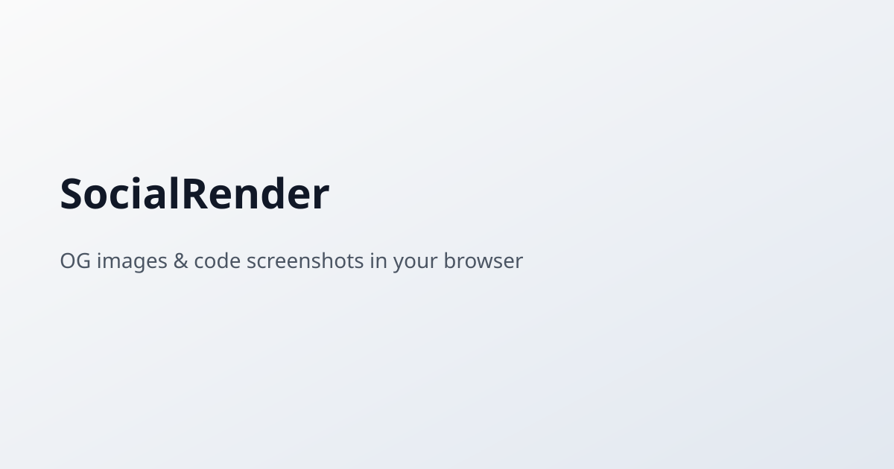

# SocialRender (`og-image-online`)

Generate **Open Graph social cards** and **syntax-highlighted code screenshots** online — themes, fonts, line highlights, and brand templates. Everything runs in your browser; your code never leaves your device.



## Features

- **Code Image** — Shiki-powered highlighting for 150+ languages (lazy-loaded per language), window chrome (macOS / Windows / none), shadows, gradients, line highlights, and custom themes.
- **OG Image** — Live social card preview with title, subtitle, accent color, and brand templates.
- **Export** — SVG, PNG, JPEG, WebP, and AVIF at 1×, 2×, and 3× DPI with size presets (Open Graph, Twitter, LinkedIn, HD, and more).
- **Share** — Encode template state in the URL hash.
- **Privacy-first** — Browser-only processing after initial load.

## Quick start

Requirements: **Node.js 22+**, **pnpm 9+**.

```bash
git clone https://github.com/chayprabs/og-image-online.git
cd og-image-online
pnpm install
pnpm dev
```

Open [http://localhost:5173](http://localhost:5173).

### Production build

```bash
pnpm build
pnpm --filter @social-render/web preview
```

Serve `packages/web/dist` on any static host (Cloudflare Pages, Netlify, nginx, etc.).

### Docker (static preview)

```bash
docker compose up --build
```

## Project structure

```
packages/
  core/   # Shiki + Satori rendering, export helpers, samples
  web/    # Vite + React playground
```

## SEO landing pages

- `/og-image-generator`
- `/code-screenshot`
- `/twitter-card-maker`
- `/linkedin-preview-image`
- `/code-to-image`

## Library API

```ts
import { renderCode, renderOG } from "@social-render/core";

const html = await renderCode({ /* CodeRenderOptions */ });
const svg = await renderOG({ /* OgRenderOptions */ });
```

## License

MIT — see [LICENSE](LICENSE).

## Contributing

See [CONTRIBUTING.md](CONTRIBUTING.md).
